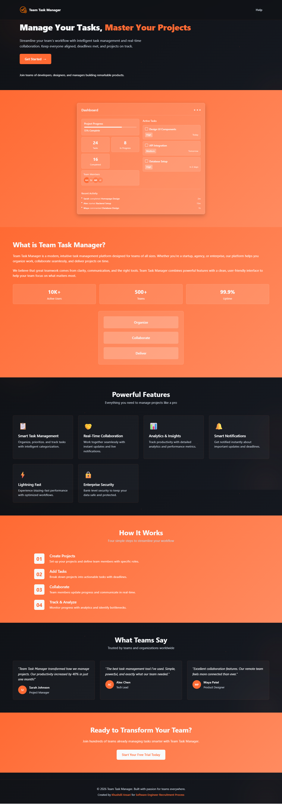
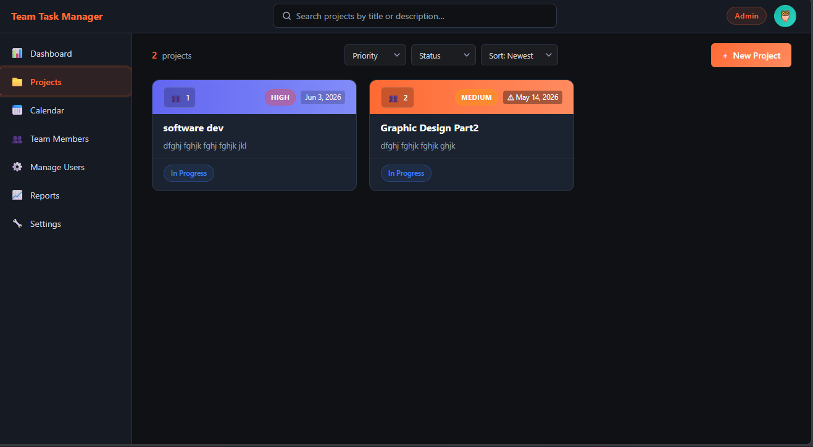
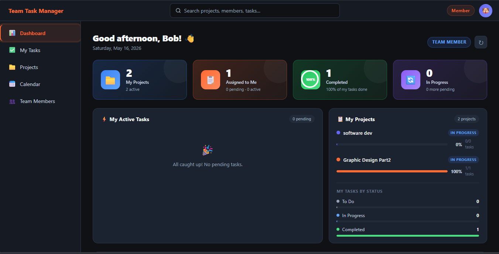
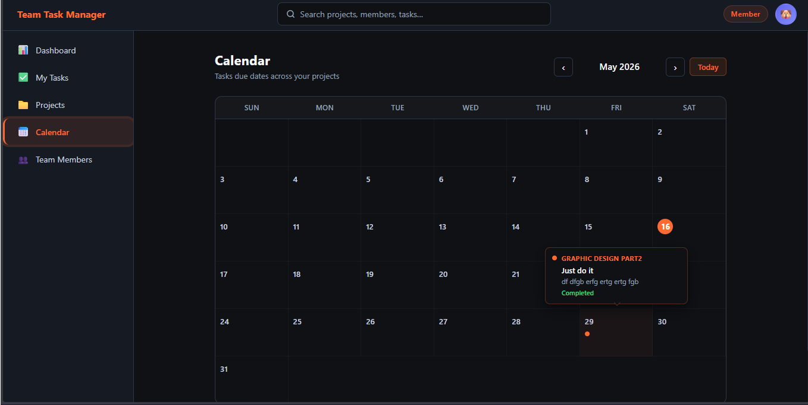
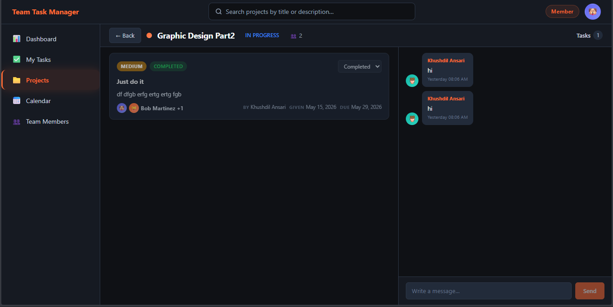

<div align="center">


# Team Task Manager

**A full-stack collaborative task management platform with role-based access, real-time dashboards, and email-verified authentication.**

[](https://reactjs.org/)
[](https://nodejs.org/)
[](https://www.mongodb.com/)
[](https://railway.app/)
[](https://jwt.io/)
[](LICENSE)

[🚀 Live Demo](https://teamtaskmanagerapp.up.railway.app/) &nbsp;·&nbsp;
[🐛 Report Bug](https://github.com/Khushdil380/TeamTaskManager/issues) &nbsp;·&nbsp;
[💡 Request Feature](https://github.com/Khushdil380/TeamTaskManager/issues)

</div>

---

## 📸 Screenshots

**Home Page**



|                     Admin Dashboard                      |                      Member Dashboard                      |
| :------------------------------------------------------: | :--------------------------------------------------------: |
|  |  |

|               Calendar View                |                Project View                |
| :----------------------------------------: | :----------------------------------------: |
|  |  |

---

## 🎬 Demo Video

[](docs/demo.mp4)

---

## ✨ Features

### 🔐 Authentication & Security

- Email + password signup with **OTP email verification** (via Brevo)
- Secure **JWT-based sessions** (7-day expiry)
- **Password reset** via OTP email
- **Professional welcome email** sent automatically after account activation
- Bcrypt password hashing — plaintext passwords never stored
- Protected routes on both frontend and backend

### 👥 Role-Based Access Control

| Capability                      | Admin | Member |
| ------------------------------- | :---: | :----: |
| Create / edit / delete projects |  ✅   |   ❌   |
| Assign tasks to team members    |  ✅   |   ❌   |
| Manage team members             |  ✅   |   ❌   |
| View analytics & reports        |  ✅   |   ❌   |
| View assigned tasks             |  ✅   |   ✅   |
| Update task status              |  ✅   |   ✅   |
| View project calendar           |  ✅   |   ✅   |
| Personal "My Tasks" feed        |  ❌   |   ✅   |

### 📊 Dashboard & Analytics

- **Admin dashboard** — project overview, task completion rings, team productivity bar charts, overdue alerts
- **Member dashboard** — personal task stats, priority breakdown, deadline tracker
- Live stats: Total tasks · Completed · In Progress · Overdue

### 📁 Project Management

- Create, edit, and delete projects with title, description, deadline, and status
- Add/remove team members per project
- Project-level progress tracking

### ✅ Task Management

- Create tasks with title, description, assignee, priority (Low / Medium / High), due date, and status
- Status flow: `Todo → In Progress → Review → Completed`
- Overdue detection with visual highlights

### 📅 Calendar View

- Monthly calendar showing all task deadlines across projects
- Role-aware tooltips (admins see project context; members see full status)

### 📱 Responsive Design

- Fully responsive across mobile, tablet, and desktop
- Custom dark theme with `#FF6A33` orange accent — zero third-party UI libraries
- Smooth CSS animations and micro-interactions

---

## 🛠️ Tech Stack

### Frontend

| Technology   | Version | Purpose                  |
| ------------ | ------- | ------------------------ |
| React        | 18.2    | UI framework             |
| Vite         | 5       | Build tool & dev server  |
| React Router | v6      | Client-side routing      |
| Custom CSS   | —       | Dark theme design system |
| Tailwind CSS | 3       | Utility classes          |

### Backend

| Technology     | Version | Purpose             |
| -------------- | ------- | ------------------- |
| Node.js        | 18+     | Runtime             |
| Express.js     | 4       | REST API framework  |
| Mongoose       | 8       | MongoDB ODM         |
| JSON Web Token | —       | Authentication      |
| Bcrypt         | —       | Password hashing    |
| Brevo REST API | —       | Transactional email |

### Infrastructure

| Service       | Purpose                    |
| ------------- | -------------------------- |
| MongoDB Atlas | Cloud database             |
| Railway       | Backend + Frontend hosting |
| GitHub        | Source control & CI/CD     |

---

## 🏗️ Architecture

```
┌─────────────────────────────────────────────────────────┐
│                      CLIENT (Browser)                   │
│              React 18 + Vite + React Router             │
└────────────────────────┬────────────────────────────────┘
                         │  HTTPS  (JWT in Authorization header)
┌────────────────────────▼────────────────────────────────┐
│                   BACKEND (Railway)                     │
│              Express.js REST API (ESM)                  │
│   Auth │ Projects │ Tasks │ Teams │ Dashboard │ Messages│
└────┬───────────────────────────┬────────────────────────┘
     │                           │
┌────▼─────┐             ┌───────▼──────┐
│  MongoDB │             │  Brevo API   │
│  Atlas   │             │  (Email OTP) │
└──────────┘             └──────────────┘
```

---

## 📂 Project Structure

```
TeamTaskManager/
├── frontend/
│   ├── src/
│   │   ├── components/        # All UI components (feature-based folders)
│   │   ├── pages/             # Route-level page components
│   │   ├── context/           # React context (auth, global state)
│   │   ├── services/          # Axios API service layer
│   │   ├── utils/             # Helpers, auth, config
│   │   └── styles/            # Global design system CSS
│   ├── vite.config.js
│   └── package.json
│
└── backend/
    ├── controllers/           # Route handlers (auth, tasks, projects…)
    ├── models/                # Mongoose schemas
    ├── routes/                # Express routers
    ├── middleware/            # JWT auth guard
    ├── services/              # emailService (Brevo)
    ├── utils/                 # password, token, validation helpers
    ├── config/                # DB connection
    └── server.js              # App entry point
```

---

## 🚀 Getting Started

### Prerequisites

- **Node.js** v18+
- **npm** v9+
- **MongoDB Atlas** account (free tier works)
- **Brevo** account for email (free tier: 300 emails/day)

### 1 — Clone the repository

```bash
git clone https://github.com/Khushdil380/TeamTaskManager.git
cd TeamTaskManager
```

### 2 — Backend setup

```bash
cd backend
npm install
```

Create `backend/.env`:

```env
PORT=5000
NODE_ENV=development
MONGODB_URI=mongodb+srv://<user>:<pass>@cluster.mongodb.net/team-task-manager
JWT_SECRET=your_strong_random_secret
BREVO_API_KEY=your_brevo_api_key
EMAIL_USER=your_verified_sender@gmail.com
FRONTEND_URL=http://localhost:5173
```

```bash
npm run dev        # starts on http://localhost:5000
```

### 3 — Frontend setup

```bash
cd ../frontend
npm install
```

Create `frontend/.env`:

```env
VITE_API_URL=http://localhost:5000/api
```

```bash
npm run dev        # starts on http://localhost:5173
```

---

## 📡 API Reference

Base URL: `/api`

<details>
<summary><strong>🔐 Auth</strong></summary>

| Method | Endpoint                | Description                                          |
| ------ | ----------------------- | ---------------------------------------------------- |
| POST   | `/auth/signup`          | Register new user (sends OTP)                        |
| POST   | `/auth/verify-otp`      | Verify OTP → activates account + sends welcome email |
| POST   | `/auth/login`           | Login with email & password                          |
| POST   | `/auth/forgot-password` | Send password reset OTP                              |
| POST   | `/auth/reset-password`  | Reset password using OTP                             |
| POST   | `/auth/resend-otp`      | Resend OTP to email                                  |
| GET    | `/auth/verify-token`    | Validate JWT and return user                         |

</details>

<details>
<summary><strong>📁 Projects</strong></summary>

| Method | Endpoint        | Description                      |
| ------ | --------------- | -------------------------------- |
| GET    | `/projects`     | Get all projects (role-filtered) |
| POST   | `/projects`     | Create project (admin)           |
| GET    | `/projects/:id` | Get project details              |
| PUT    | `/projects/:id` | Update project (admin)           |
| DELETE | `/projects/:id` | Delete project (admin)           |

</details>

<details>
<summary><strong>✅ Tasks</strong></summary>

| Method | Endpoint          | Description                       |
| ------ | ----------------- | --------------------------------- |
| GET    | `/tasks`          | Get tasks for a project           |
| POST   | `/tasks`          | Create task (admin)               |
| PUT    | `/tasks/:id`      | Update task                       |
| DELETE | `/tasks/:id`      | Delete task (admin)               |
| GET    | `/tasks/my-tasks` | Get current user's assigned tasks |
| GET    | `/tasks/calendar` | Get tasks formatted for calendar  |

</details>

<details>
<summary><strong>👥 Team & Dashboard</strong></summary>

| Method | Endpoint     | Description             |
| ------ | ------------ | ----------------------- |
| GET    | `/team`      | List team members       |
| POST   | `/team`      | Add member (admin)      |
| DELETE | `/team/:id`  | Remove member (admin)   |
| GET    | `/dashboard` | Get dashboard analytics |

</details>

---

## ☁️ Deployment

Both services are deployed on **Railway** with automatic deploys on `git push`.

| Service  | Platform                | URL                                              |
| -------- | ----------------------- | ------------------------------------------------ |
| Frontend | Railway (serve -s dist) | `teamtaskmanager-production-5902.up.railway.app` |
| Backend  | Railway (Node.js)       | `teamtaskmanager-backend.up.railway.app`         |
| Database | MongoDB Atlas           | Cloud                                            |

> **Note:** Railway blocks outbound SMTP. This project uses the **Brevo HTTP API** (`https://api.brevo.com/v3/smtp/email`) over HTTPS port 443 to deliver emails reliably.

---

## 🤝 Contributing

Contributions are welcome!

```bash
# 1. Fork the repo
# 2. Create a feature branch
git checkout -b feature/your-feature-name

# 3. Commit your changes
git commit -m "feat: add your feature"

# 4. Push and open a Pull Request
git push origin feature/your-feature-name
```

---

## 👨‍💻 Author

<div align="center">

**Khushdil Ansari**

[](https://github.com/Khushdil380)
[](https://khushdil-ansari-portfolio-frontend.vercel.app/)
[](mailto:helpteamtaskmanager@gmail.com)

_Built as part of the Software Engineer Recruitment Process_

</div>

---

## 📄 License

This project is licensed under the **MIT License** — see the [LICENSE](LICENSE) file for details.

---

<div align="center">

Made with ❤️ and ☕ by [Khushdil Ansari](https://khushdil-ansari-portfolio-frontend.vercel.app/)

⭐ **Star this repo if you found it useful!**

</div>
